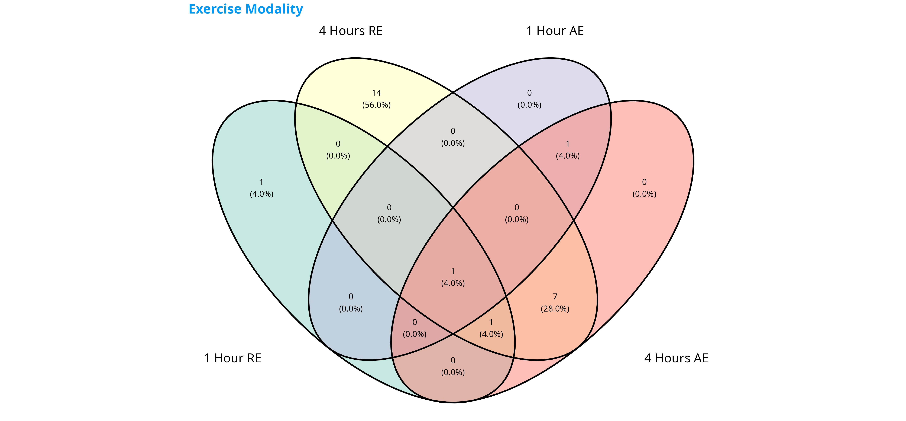
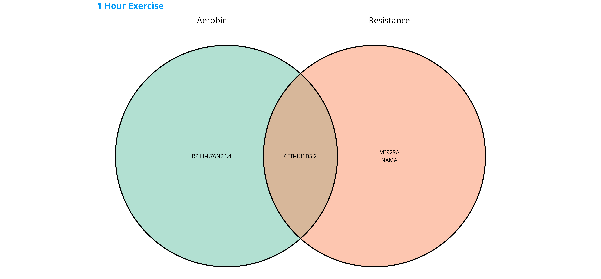
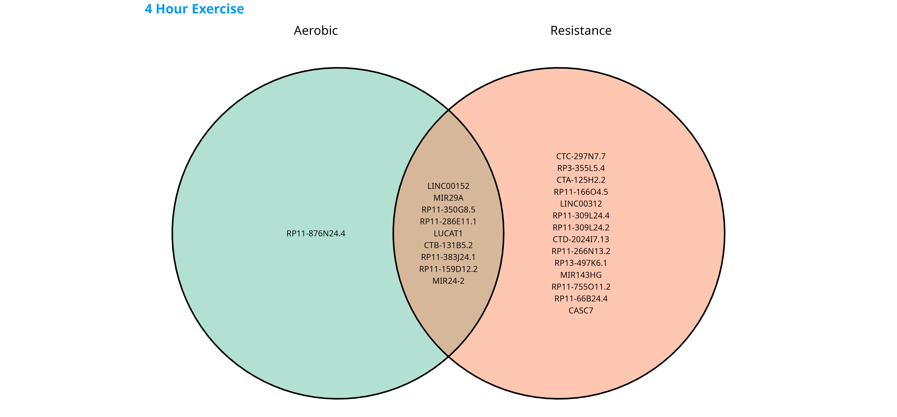

<!-- README.md is generated from README.Rmd. Please edit that file -->

```{r, include = FALSE}
knitr::opts_chunk$set(
  collapse = TRUE,
  comment = "#>"
)
```

# Analysis of lncRNAs after acute exercise

## Background

This repository serves to analyze the changes in long non-coding RNAs (lncRNAs) after an acute bout of aerobic or resistance exercise. 

Exercise induces a multitude of physiological changes, and many of these are downstream of changes in cellular gene expression. Though there has been a great deal of study into protein-coding genes, there has been little research into the response of non-coding RNAs in response to exercise. Here, we seek to address this gap. We examine this problem along two different dimensions - exercise modality and exercise time.

We first show similarities and differences in lncRNA expression after different durations and types of exercise.

```{r, echo=FALSE, out.width="100%"}

```

For a more granular view, we can examine the pairwise venn diagrams between resistance and aerobic exercise.

```{r, echo=FALSE, out.width="70%", fig.show="hold", fig.align="center", out.height="20%"}
knitr::include_graphics(c("images/Aerobic_Exercise.png", "images/Resistance_Exercise.png"))



```

***

We can expand upon the the differences in lncRNA expression after aerobic exercise compared to baseline using a volcano plot.

```{r, echo=FALSE, out.width="100%"}
knitr::include_graphics("images/lncRNA_aerobic_volcano.png")
```

***

We can do the same for resistance exercise.

```{r, echo=FALSE, out.width="100%"}
knitr::include_graphics("images/lncRNA_resistance_volcano.png")
```

***


## Directories
The 'proc' folder contains post-processed results and tables.
The 'images' folder contains generated figures from the manuscript and repository

## Usage
To use this package, simply run the `main.R` script in R version 4.3.0 or higher.
To generate venn diagrams, run the `generateVennDiagrams.R` script after.

## Attribution

This project is a collaboration between the [Muscle Physiology Lab](https://skhs.queensu.ca/qmpl/) at Queen's University and the [Clarke Laboratory for Quantitative Exercise Biology](https://www.sfu.ca/clarkelab-bpk.html) at Simon Fraser University.

